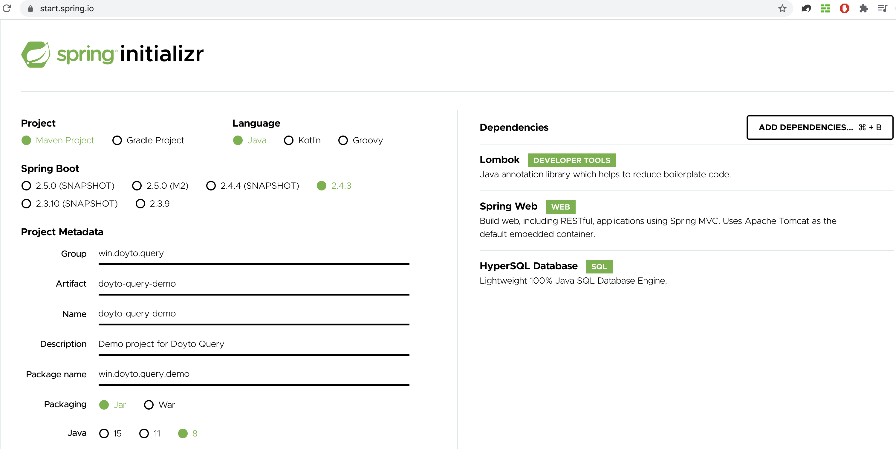

# 入门教程

1. 介绍目标
2. 开始项目
   1. 初始化工程
      1. 在[Spring Initializer](https://start.spring.io/)上
      2. 引入依赖
      3. 添加
   2. 初始化数据
   3. 配置分页插件
   4. 创建业务类
      1. MenuEntity
      2. MenuQuery
      3. MenuController
   5. 启动工程进行验证
   6. 添加query字段
      1. menuNameLike
      2. MenuQuery
3. 总结展望



### 

* MenuEntity.java


```java
@Getter
@Setter
@Entity
@Table(name = "t_menu")
public class MenuEntity extends CommonEntity<Integer, Long> {

    private Integer parentId;

    private String menuName;

    private String memo;

    private Boolean valid;

}
```


* MenuQuery.java

```java
@Getter
@Setter
@SuperBuilder
@NoArgsConstructor
@AllArgsConstructor
public class MenuQuery extends PageQuery {

}
```

* MenuController.java

```java
@RestController
@RequestMapping("menu")
public class MenuController extends AbstractIQEEController<MenuEntity, Long, MenuQuery> {
}
```

